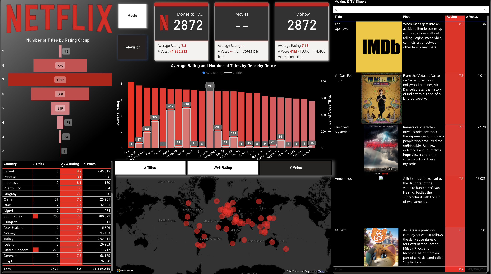

# 🍿 Netflix Data Analysis Dashboard - Power BI Project

This Power BI project analyzes viewing and content trends on the Netflix platform using a structured dataset. The interactive dashboard showcases KPIs, content classification, and insights across various genres, countries, and release years.

---

## 🎯 Project Objectives

- Visualize content trends by genre, type, rating, and geography  
- Analyze Netflix’s content additions over time  
- Identify key contributors like top actors and directors  
- Provide stakeholders with dynamic content filtering  
- Demonstrate end-to-end BI development with Power BI

---

## 🧾 Dataset Description

The dataset includes:
- **Title, Type** (Movie/TV Show)  
- **Country, Date Added, Release Year**  
- **Rating, Duration, Genre, Cast**

📦 **Source**: [Netflix TV Shows and Movie List – Kaggle](https://www.kaggle.com/datasets/snehaanbhawal/netflix-tv-shows-and-movie-list)

> This dataset is publicly available and widely used for streaming content analytics.

---

## 📊 Dashboard Features

- 📅 Content by Year and Type  
- 🌍 Country-wise distribution of titles  
- 🎭 Top 10 Genres and Ratings  
- 👥 Most Frequent Actors and Directors  
- 🧰 Filters: Year, Type, Rating, Country, Genre

---

## 📌 Key Insights

- 🇺🇸 USA and 🇮🇳 India dominate Netflix’s content catalog  
- 📈 Most content was added between 2016–2020  
- 🎬 Movies make up the majority of the catalog  
- 👥 “David Attenborough” and “Anupam Kher” are among the most frequent contributors  
- 📅 TV Shows tend to have seasonal durations while movies list in minutes

---

## 📈 KPIs Tracked

- Total Titles  
- Movie Count vs. TV Show Count  
- Titles by Country and Genre  
- Yearly Content Additions  
- Top 10 Actors, Directors, Ratings  
- Duration Analysis by Type

---

## 🧠 DAX Formulas (Examples)

```dax
Total Titles = COUNTROWS(Netflix)

Movies Count = CALCULATE(COUNTROWS(Netflix), Netflix[Type] = "Movie")

TV Shows Count = CALCULATE(COUNTROWS(Netflix), Netflix[Type] = "TV Show")

Top Country = 
    CALCULATE(
        COUNT(Netflix[Title]), 
        ALLEXCEPT(Netflix, Netflix[Country])
    )
```

📘 References:
- [DAX Guide](https://dax.guide/)
- [Microsoft Learn - Power BI](https://learn.microsoft.com/en-us/power-bi/)

---

## 🔍 QA & Validation

- ✅ Verified DAX outputs using card visuals and filters  
- ✅ Checked date hierarchies and missing/null values in Power Query  
- ✅ Ensured slicers interact smoothly across all visuals  
- ✅ Validated country-level splits for top contributors

---


## ⚙️ How to Replicate

1. Download or clone this repository  
2. Open `NETFLIX.pbix` in Power BI Desktop  
3. Connect to your dataset or refresh with included sample  
4. Interact with filters, visuals, and tooltips  
5. Optional: Publish to Power BI Service for web access

---

## 🗃️ Data Sources & Cleaning

- Original .xlsx downloaded from Kaggle  
- Cleaned column names and filtered missing/null values in Power Query  
- Added calculated columns for `Year`, `Duration Group`, and `Content Age`  
- Linked multiple fields via relationships to enable cross-filtering

---

## 🧱 Data Model Overview


The data model follows a star schema with fact table: `Netflix`, and dimension-like fields: `Country`, `Date`, `Cast`, `Category`.

---

## 🧗 Challenges Faced

- Parsing multi-value fields like cast names and genres  
- Handling missing values in Country and Date Added  
- Ensuring consistency across filters and visuals  
- Creating DAX measures that adapt dynamically across slicers

---

## 🌐 Deployment

- Power BI Desktop for development  
- Optional: Publish to Power BI Service and share using public embed link or Power BI workspace access

---

## 🛠 Tools Used

- Power BI Desktop  
- Power Query (for ETL)  
- DAX (for metrics and KPIs)  
- Data modeling and visualization tools

---

## 📁 Repository Structure

```
📁 Netflix-PowerBI-Project
│
├── README.md
├── NETFLIX.pbix
├── 📁 Data/
│   └── netflix_Listings.xlsx
├── 📁 Images/
│   └── Background.png
│   └── logo.png
```

---

## 👩‍💻 Author

**Shivani Enugandula**  
🔗 [LinkedIn](https://www.linkedin.com/in/shivani-enugandula/)

---

This project is a showcase of BI storytelling using a popular entertainment dataset. Feel free to fork, contribute, or use as a learning reference.

